<p style="display: flex; align-items: center; justify-content: center; gap: 10px;">
  
  <strong style="font-size: 32px;">KomaStream</strong>
</p>

<p align="center">
  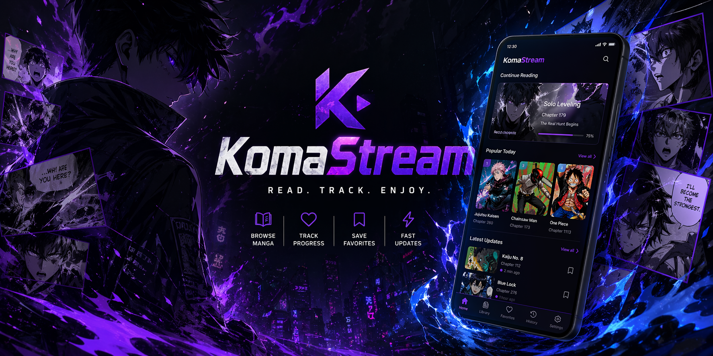
</p>

<p align="center">
  Android manga reader client focused on a clean native UI, local-first tracking, and user-controlled provider access.
</p>

<p align="center">
  <a href="https://github.com/Paduu29/KomaStream/releases">Download latest release</a>
  ·
  <a href="#features">Features</a>
  ·
  <a href="#building-from-source">Build from source</a>
  ·
  <a href="#legal-and-usage">Legal and usage</a>
</p>

KomaStream is an Android app for browsing catalogs, tracking progress, and reading chapters from third-party services directly on your device. The project is built as a client application only: it does not host, upload, mirror, or distribute manga content.

> The screenshots below use sanitized or low-risk examples to avoid exposing unnecessary provider details or third-party artwork in the repository.

## Screenshots

| Home | Catalog | Provider picker |
| --- | --- | --- |
| 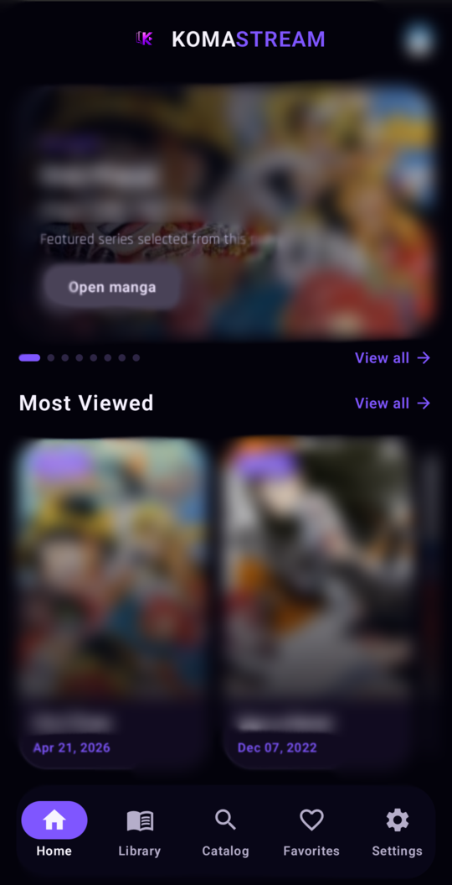 | 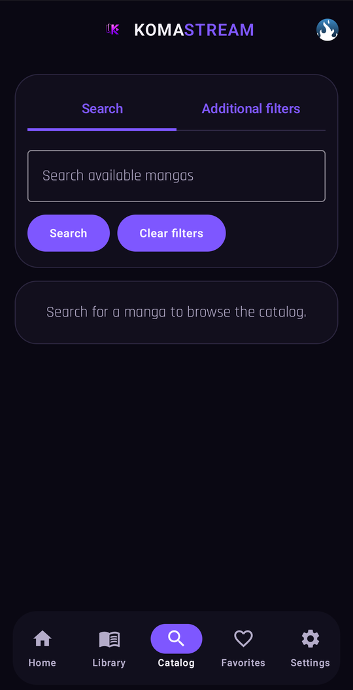 | 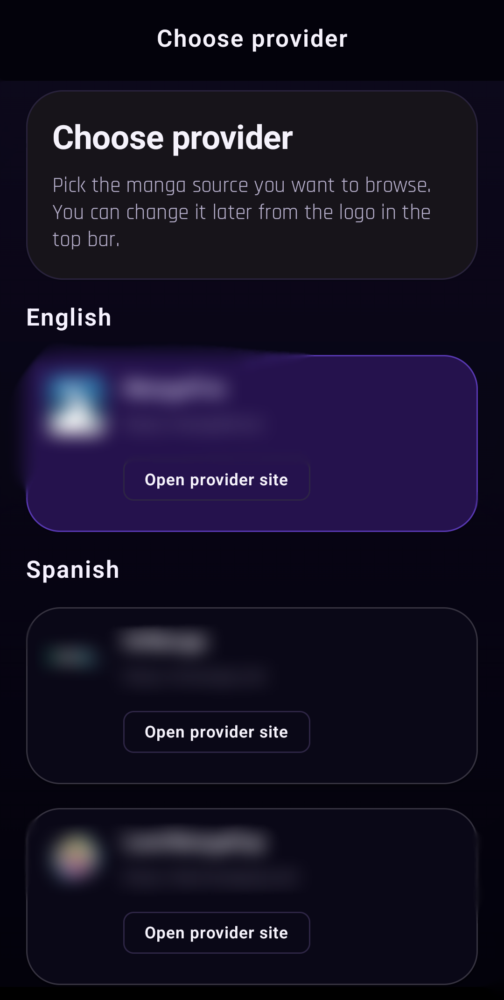 |
| Detail | Chapters | Reader |
| 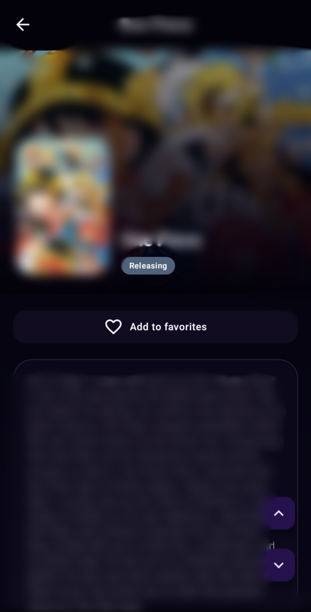 | 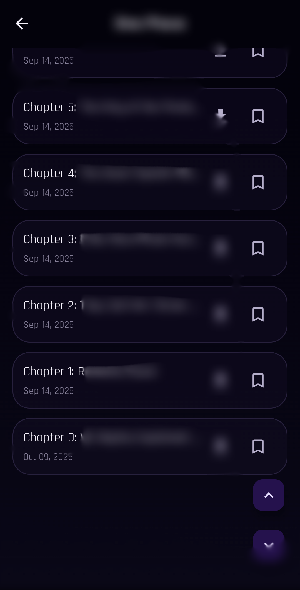 | 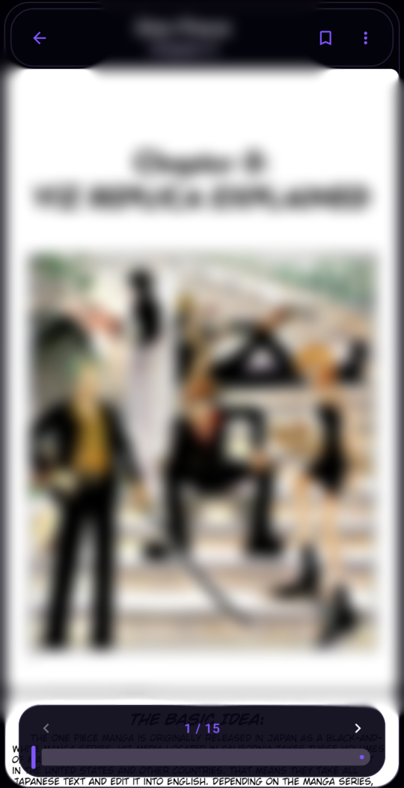 |
| Library empty | Library active | Favorites empty |
| 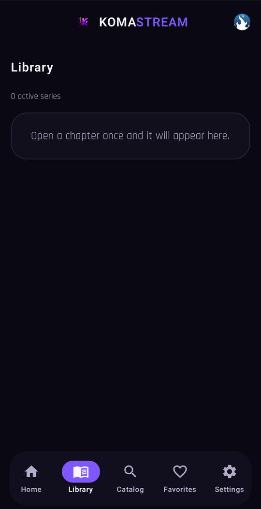 | 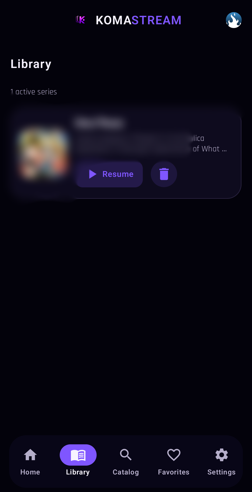 | 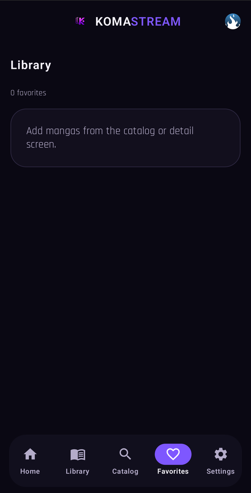 |
| Favorites active | Settings |  |
| 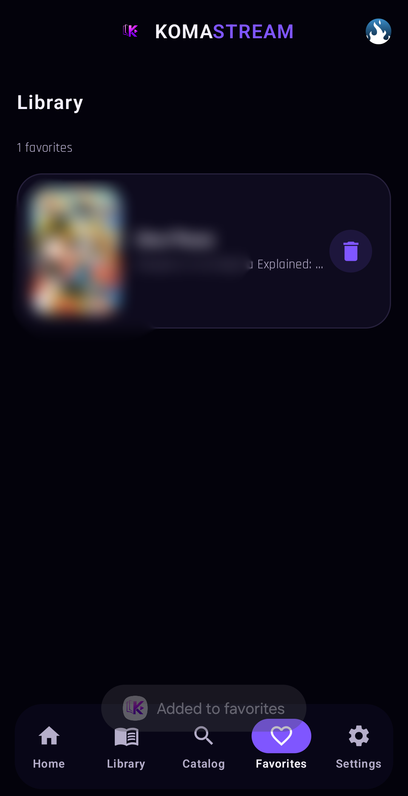 | 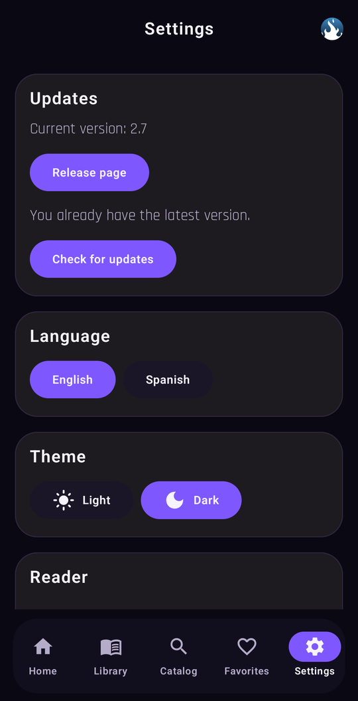 |  |

## Features

- Native Android app written in Kotlin
- Jetpack Compose UI with light and dark themes
- Browse provider catalogs with search and filtering
- Track favorites, library entries, history, and chapter progress locally
- Backup export and import for local data
- English and Spanish localization
- In-app updater for GitHub release builds
- No account system and no project-operated backend

## How It Works

KomaStream acts as a user-controlled client.

- Content requests are made from the user device to the selected third-party service
- The app does not run content servers or proxy manga files through project infrastructure
- The repository does not ship copyrighted manga content
- User data such as favorites, reading history, progress, and preferences stays on-device

## Tech Stack

- Kotlin
- Android SDK
- Jetpack Compose
- OkHttp
- Jsoup
- WorkManager

## Requirements

### App runtime

- Android 7.0 or newer (`minSdk 24`)

### Development

- Android Studio
- JDK 17
- Android SDK installed locally

## Building From Source

### Clone

```bash
git clone https://github.com/Paduu29/KomaStream.git
cd KomaStream
```

### Build a debug APK

```bash
./gradlew :app:assembleDebug
```

Output:

```text
app/build/outputs/apk/debug/app-debug.apk
```

### Open in Android Studio

1. Open Android Studio.
2. Select **Open**.
3. Choose the `KomaStream` project directory.
4. Let Gradle sync finish.
5. Run the app on an emulator or a physical device.

## Contributing

Contributions are welcome if they stay within the project scope and legal constraints.

- Keep changes focused and well-scoped
- Follow the existing code style and architecture
- Include screenshots for UI changes where useful
- Test changes before opening a pull request
- Do not add or promote unauthorized or infringing content sources

## Privacy

KomaStream does not require user accounts and does not operate its own backend. App data is stored locally on the device, and network traffic goes directly from the device to the selected third-party service.

## Legal and Usage

KomaStream is open-source client software. It is intended to be used only with content sources that the user is legally allowed to access.

- No copyrighted manga content is included in this repository
- The project does not redistribute third-party content
- All trademarks and copyrights belong to their respective owners
- Nothing in this repository should be interpreted as legal advice or authorization to access protected content unlawfully

Users are responsible for complying with applicable laws, local regulations, and the terms of service of any third-party service they choose to use.

## License

This project is licensed under the GNU General Public License v3.0. See [LICENSE](LICENSE).
